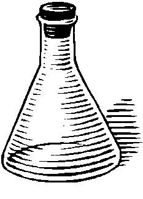

<table><tr><td nowrap>

#Alchemy

**a framework for running A/B experiments -- fast and ops-friendly!**
</td><td>

</td></tr><tr><td colspan="2">

It's written using Dropwizard, a *simple* and *lightweight* REST service framework composed of *stable* and *mature* libraries from the Java ecosystem.
 
- Table of Contents
  * [Manual](docs/manual.md)
  * [About](docs/about.md)

</td></tr><table>